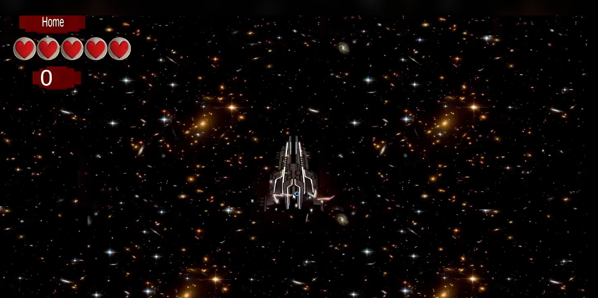
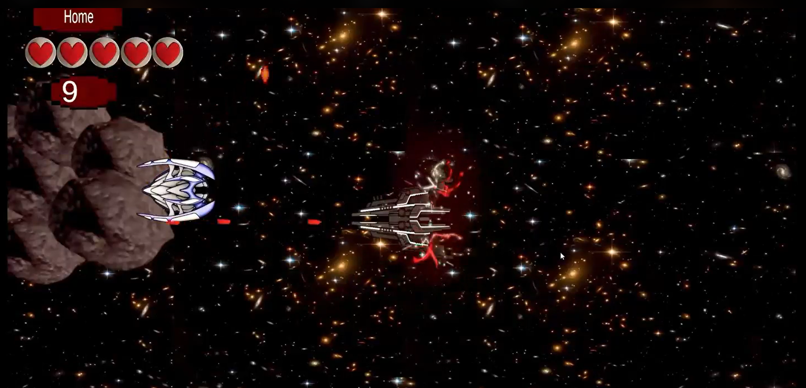
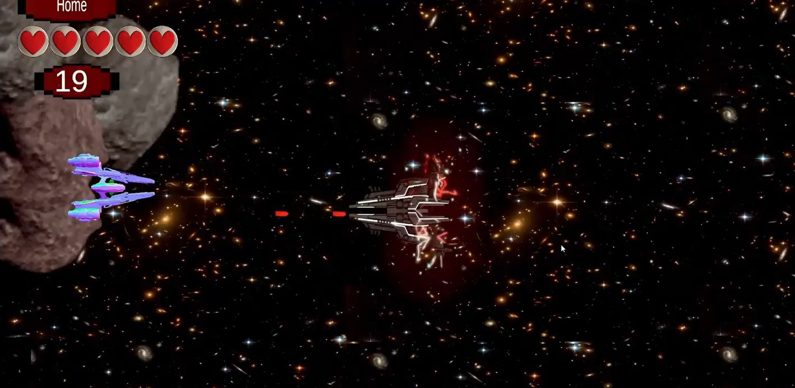
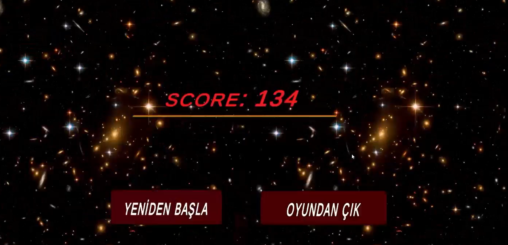

# 🚀 Rocket Shooter Project Refactoring

Bu proje, daha profesyonel bir yapıya ve standartlara (Unity/C#) kavuşturulması amacıyla modernize edilmiştir.

## 🛠 Yapılan İyileştirmeler

### 1. Dosya ve Klasör Yapısı (Refactoring)
- **Script Klasörü**: `Script` -> `Scripts` olarak güncellendi. (Standart Unity isimlendirmesi)
- **Görseller**: Karışık olan görseller `Screenshots` klasörüne taşındı ve profesyonel isimler verildi.
- **İsimlendirme**: Tüm dosya ve klasör isimleri **PascalCase** standartlarına uygun hale getirildi.

### 2. Kod İyileştirmeleri (Script Professionalization)
Tüm scriptler Unity topluluk standartlarına ve profesyonel oyun geliştirme pratiklerine göre güncellenmiştir:
- **atesleme.cs** -> `RocketFiring.cs` (Ateşleme mekaniği modernize edildi)
- **MainCameraFallow.cs** -> `CameraFollow.cs` (Yazım hatası düzeltildi)
- **asteroitCanBullet.cs** -> `AsteroidBullet.cs` (Daha anlaşılır isimlendirme)
- **enimyOtoBullet.cs** -> `EnemyAutoBullet.cs` (Yazım hatası düzeltildi)
- **healthBar.cs** -> `HealthBar.cs` (PascalCase uygulandı)
- **score.cs** -> `ScoreManager.cs` (Daha spesifik isimlendirme)
- **Scenes.cs** -> `SceneLoader.cs` (Görevi daha net belirtildi)
- **Buy.cs** -> `ShopManager.cs` (Daha profesyonel)
- **PlayerControl.cs** -> `PlayerController.cs` (Standart isimlendirme)

### 3. Görsel Düzenlemeler
Görsellerin isimleri kullanım amaçlarına göre yeniden adlandırılmıştır:
- `gameplay_main.png`
- `gameplay_action.png`
- `gameplay_ui.png`
- `gameplay_gameover.png`

## 📁 Mevcut Yapı
```text
.
├── RocketGame/
│   ├── Assets/
│   │   ├── Scripts/      # Modernize edilmiş C# scriptleri
│   │   ├── Scenes/       # Oyun sahneleri
│   │   └── ...
│   ├── Builds/           # Çalıştırılabilir dosyalar (.exe)
├── Screenshots/          # Oyun içi ekran görüntüleri
└── README.md             # Proje dokümantasyonu
```

## 🚀 Başlangıç
Projeyi Unity'de açtıktan sonra `Assets/Scenes` altındaki ana sahneyi yükleyerek başlayabilirsiniz. Scriptler otomatik olarak yeni sınıfları tanıyacaktır.

## 🖼 Görseller

Aşağıda oyunun güncel ve modernize edilmiş halinden bazı görüntüler yer almaktadır:

<p align="center">
  
  
</p>

<p align="center">
  
  
</p>

---
*Geliştirici Notu: Bu düzenlemeler projenin bakımını kolaylaştırmak ve takım çalışmasına uygun hale getirmek için yapılmıştır.*
